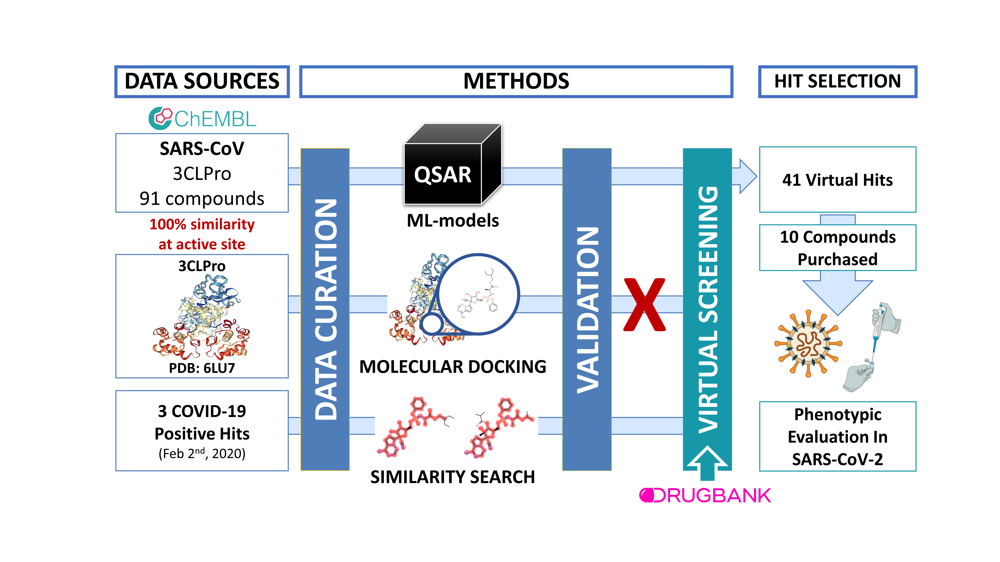
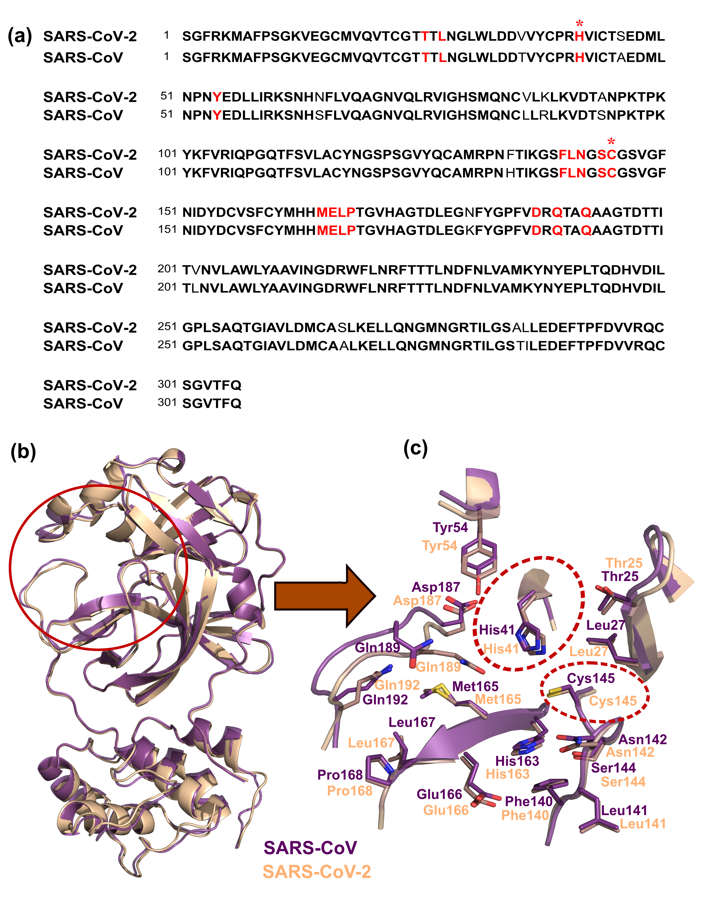
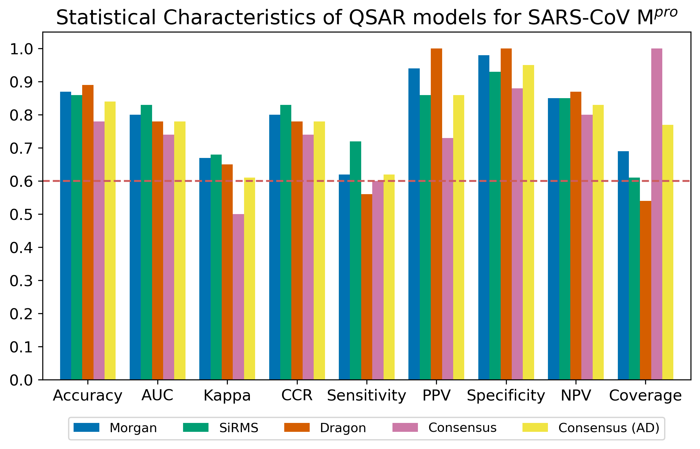

# Computational models identify several FDA approved or experimental drugs as putative agents against SARS-CoV-2

The main goal of this study was to find drugs that could be repurposed for SARS‐CoV‐2. To this end, we curated open‐source data on Mpro inhibitors for both SARS‐CoV‐2 and SARS‐CoV. We also employed both structure‐ and ligand‐based computational approaches to select a set of compounds that may have the potential to inhibit SARS‐CoV‐2 replication by inhibiting Mpro. In this initial investigation, we have exclusively focused on FDA approved medications or experimental/investigational compounds because these could be quickly repurposed as COVID‐19 treatments if their experimental validation is successful. Before submitting this manuscript for peer‐review, we deposited a preprint version online on April 22, 202043, and later, when NCATS released screening data on April 29, 2020, we had the opportunity to validate our predictions as reported in our [publication](https://onlinelibrary.wiley.com/doi/full/10.1002/minf.202000113).

As shown in the workflow below, we employed three different computational strategies to screen DrugBank to find the drug repurposing candidates against SARS‐CoV‐2: QSAR models, docking, and similarity searching.

  
 

We started by collecting all publicly available data on SARS‐CoV‐2 and other coronaviruses and focused on Mpro as a critical target for SARS‐CoV‐2 replication. Since no data was available for SARS-CoV-2, we used data available for SARS-CoV. Using Basic Local Alignment Search Tool (BLAST) available in [UniProt](https://www.uniprot.org/blast/), we observed that the primary sequences of Mpro in both SARS‐CoV and SARS‐CoV‐2 had 96 % identity (see the figure below). The crystal structure of SARS‐CoV‐2 Mpro was recently elucidated and superposition of the respective 3D protein structures (PDB IDs: 5N19, 6LU7) revealed a conserved binding site around the co‐crystallized inhibitors including the catalytic dyad represented by His41 and Cys145. This level of conservation makes SARS-CoV Mpro a particularly attractive target, as compounds inhibiting this protease could possibly serve as antivirals against other pathogenic coronaviruses such as SARS‐CoV‐1 and MERS‐CoV.

  
 

 
Unfortunatelly, we found that docking scores were poorly correlated with the binding affinity as indicated by the area under the receiver operating characteristic (ROC) score of 0.49. Additionally, the early enrichment was poor with a sensitivity of only 0.11 for the top 10 % ranked compounds, i.e., actives were ranked poorly while inactives were occupying the top of the list of virtual hits. The top 15 % also presented poor sensitivity (0.14). Only after the top 69 % of the list was considered, the sensitivity reached reasonable values (0.70). Based on these results, docking was discarded as a viable virtual screening approach as applied to Mpro. Therefore, we proceeded only with QSAR models and similarity search.

## Characteristics of QSAR models

The statistical characteristics of our QSAR models are shown below.

  
 

## Virtual hits submitted for experimental validation

In total, we selected 42 hits from DrugBank predicted by at least two out of the three QSAR models built independently with SiRMS, Dragon, and Morgan descriptors; this list included four compounds also identified by similarity search: lurbinectedin, rifalazil, vinblastine and 3′′‐(beta‐chloroethyl)‐2′′,4′′‐dioxo‐3, 5′′‐spiro‐oxazolidino‐4‐deacetoxy‐vinblastine as active. Our hits have been found among commercially available compounds listed in the [ZINC database](https://zinc.docking.org/) and the vendors selling these compounds were identified using our in‐house ZINC Express software (https://zincexpress.mml.unc.edu/). The complete list of predictions is avalable [here](https://github.com/alvesvm/sars-cov-mpro/blob/master/mol-inf-2020/supplementary-materials.xlsx).

On April 22, 2020, we deposited this work as a preprint on [ChemRxiv](https://doi.org/10.26434/chemrxiv.12153594.v1), including a selection of computational hits. A week later, on April 29, 2020, NCATS released, via [OpenData Portal](https://opendata.ncats.nih.gov/covid19/), the quantitative HTS data on drugs approved for clinical use tested in the SARS-CoV-2 CPE assay.

We found that 11 out of 42 compounds identified by our models as computational hits were tested by NCATS. Three of them, sufugolix (annotated as NCGC00509985‐02), cenicriviroc, and proglumetacin, were shown to be active. Sufugolix and cenicriviroc had AC50 of 12.6 μM and 8.9 μM, respectively, and proglumetacin, which was independently tested twice and had two associated records with AC50 of 12.6 and 8.9 μM. The remaining nine compounds (atazanavir, barasertib, indinavir, lurbinectedin, navitoclax, tilmicosin, venetoclax, and vinblastine) were inactive. The summary of results reported by NCATS for these 11 compounds is given in the table below. 

#### List of 11 hits selected by QSAR models and tested by NCATS.
|     Drug Name        |     NCATS ID           |     DrugBank   recorded status       |     CPE (µM)          |
|----------------------|------------------------|--------------------------------------|-----------------------|
|     Cenicriviroc     |     NCGC00685392-02    |     investigational                  |     8.9               |
|     Sufugolix        |     NCGC00509985-02    |     investigational                  |     12.6              |
|     Proglumetacin    |     NCGC00183024-01    |     experimental                     |     12.5 and 8.91     |
|     Atazanavir       |     NCGC00182552-02    |     approved; investigational        |     Inactive          |
|     Barasertib       |     NCGC00378734-08    |     investigational                  |     Inactive          |
|     Indinavir        |     NCGC00159460-01    |     approved                         |     Inactive          |
|     Lurbinectedin    |     NCGC00510477-01    |     investigational                  |     Inactive          |
|     Navitoclax       |     NCGC00188344-07    |     investigational                  |     Inactive          |
|     Tilmicosin       |     NCGC00348375-01    |     investigational; vet_approved    |     Inactive          |
|     Venetoclax       |     NCGC00345789-05    |     approved; investigational        |     Inactive          |
|     Vinblastine      |     NCGC00263548-23    |     approved                         |     Inactive          |

## More information
For more information, please refer to our paper: 
Alves, V. M.; Bobrowski, T.; Melo‐Filho, C. C.; Korn, D.; Auerbach, S.; Schmitt, C.; Muratov, E. N.; Tropsha, A. QSAR Modeling of SARS‐CoV M pro Inhibitors Identifies Sufugolix, Cenicriviroc, Proglumetacin, and Other Drugs as Candidates for Repurposing against SARS‐CoV‐2. *Mol. Inform.* **2021**, *40* (1), 2000113. https://doi.org/10.1002/minf.202000113.

## Acknowledgements

This work was sponsored by the [UNC Eshelman School of Pharmacy](https://pharmacy.unc.edu/) of the [University of North Carolina at Chapel Hill](https://www.unc.edu/) in collaboration with the [National Institute of Environmental Health Sciences](https://www.niehs.nih.gov/).

  
  
  
   

